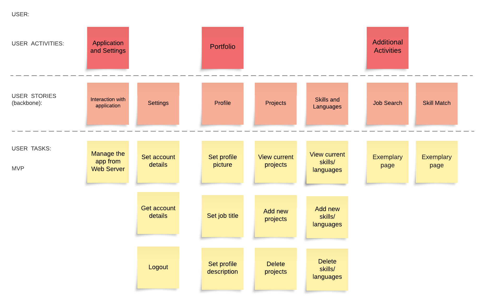

[Victoria-Kim Bui]
{: .label }

# [Goals achieved and missed]
{: .no_toc }

  

    Table of contents
  

  {: .text-delta }
- TOC
{:toc}

## Goals and Expectations

At the outset of the project, we established clear goals and expectations for our web application. These goals encompassed user-centric aspects, user stories, user activities, and a well-defined timeline with deadlines. Our vision was to create a functional and user-friendly web app that aligned with the identified user needs.

### User-Centric Focus

Our primary goal was to develop a web application that catered to the needs and preferences of our target users *Job Seeker* and *Guest*. This included creating a seamless and intuitive user experience through well-designed interfaces and features. 

### User Stories and Activities

To guide our development process effectively, we utilized a user story map to help visualize and denote necessary functions for the users. It allowed us to gain a deeper understanding of the user interactions and prioritize features accordingly. 

### Time Schedule and Deadlines

To manage our project effectively, we established a time schedule with specific deadlines for each phase of development. This schedule provided us with a roadmap to follow and allowed us to track our progress.

### Challenges and Adaptations

While our initial intention was to adhere strictly to the established timeline, external factors such as other projects and impending deadlines impacted our ability to follow the schedule completely. We encountered challenges in balancing our commitments and occasionally had to adapt our plans to accommodate unforeseen demands.

Despite these challenges, our commitment to the project remained unwavering. We continually revised our schedule and made the necessary adjustments to ensure that the quality of our work was not compromised.

In hindsight, the experience of managing our goals, expectations, and timeline has provided us with valuable insights into project management and team collaboration. As we move forward, we aim to apply these lessons to optimize our approach in future endeavors.
