[Florian Eppe]
{: .label }

# [API reference]
{: .no_toc }

  

    Table of contents
  

  {: .text-delta }
- TOC
{:toc}

## Login & Registration

### `get_login()`

**Route:** `/login/`

**Methods:** `POST` `GET` 

**Purpose:** Takes email and password from Userinput, gets User from database with corresponding email and checks validity of password. If Invalid login credentials, error is shown. If successfull forward to Portfolio

**Sample output:**

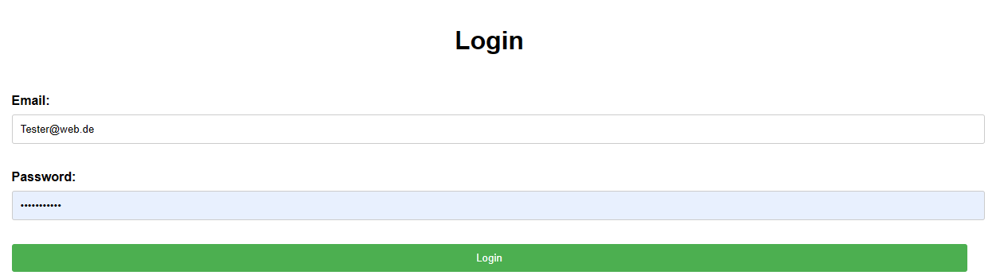

---

### `get_signup()`

**Route:** `/signup/`

**Methods:** `POST` `GET` 

**Purpose:** Registry of User. User provides first_name, last_name, email, phone_number, street, zipcode, city and password. If password is length <8, has min. 1 letter, has min. 1 number and given passwords match, than password gets hashed and User is saved in database

**Sample output:**
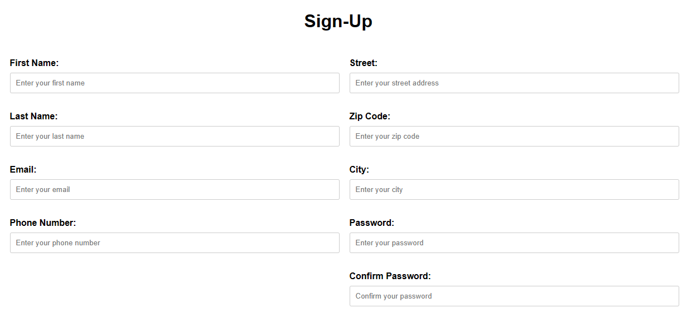

---

## Home

### `get_home()`

**Route:** `/home/`

**Methods:** `GET`

**Purpose:** Show Home-Page

**Sample output:**

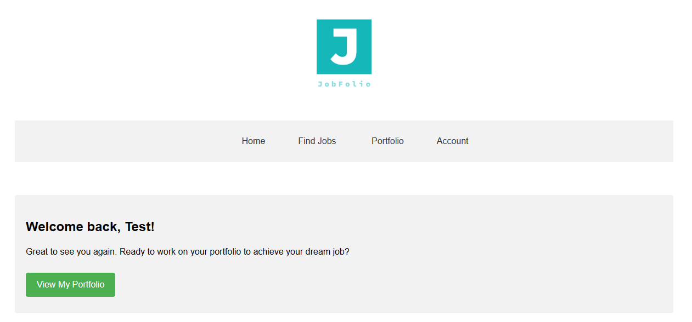

---

## Account

### `get_account()`

**Route:** `/account/`

**Methods:** `GET`

**Purpose:** show button for Logout from Account and show User-Data: first_name, last_name, email, phone_number, street, zipcode, city 

**Sample output:**

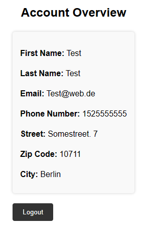

### `get_logout()`

**Route:** `/logout`

**Methods:** `POST`

**Purpose:** Logout User

**Sample output:**

## Find Jobs

### `get_findjobs()`

**Route:** `/findjobs/`

**Methods:** `POST`

**Purpose:** show static html page (without functionality) for Finding Your Dream Job

**Sample output:**
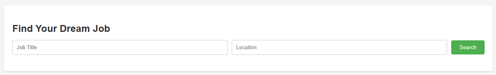

## Portfolio

### `get_portfolio()`

**Route:** `/portfolio/`

**Methods:** `POST`

**Purpose:** Show saved User-Profile-Data, Projects, Languages and Skill of User from database

**Sample output:**
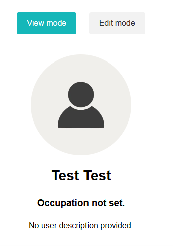

### `get_portfolio_edit()`

**Route:** `/portfolio_edit/`

**Methods:** `POST`

**Purpose:** Show edit mode of Portfolio. User-Profile, Projects, Languages and Skills can be edited here

**Sample output:**
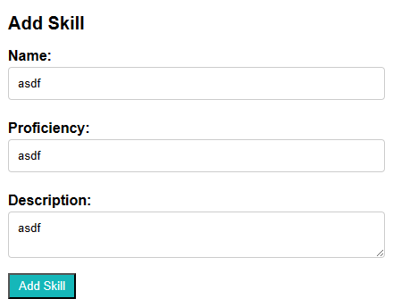

### `get_project_form()`

**Route:** `/create_project/`

**Methods:** `POST`

**Purpose:** Adds project to database and forwards to Portolio-View with new project on display

**Sample output:**
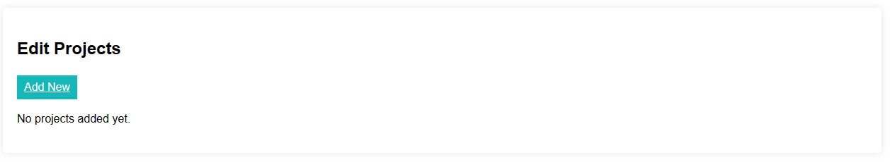

### `get_add_skill()`

**Route:** `/edit_skill/`

**Methods:** `POST`

**Purpose:** Adds skill to database and forwards to Portolio-View with new skill on display

**Sample output:**
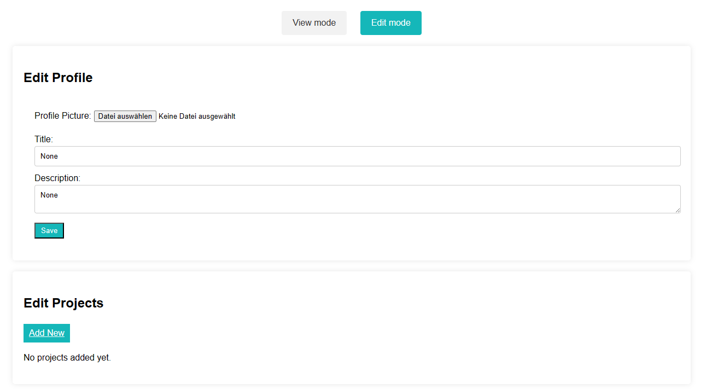

### `get_add_lang()`

**Route:** `/edit_lang/`

**Methods:** `POST`

**Purpose:** Adds language to database and forwards to Portfolio-View with new language on display

**Sample output:**
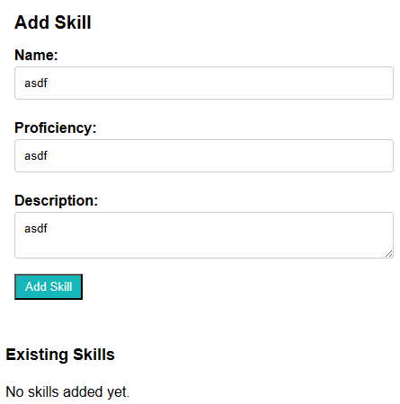

### `get_delete_language(language_id)`

**Route:** `/delete_language/<int:language_id>`

**Methods:** `POST`

**Purpose:** Deletes a language from database and forwards to Portfolio-View without deleted language on display

### `get_delete_language(language_id)`

**Route:** `/delete_skill/<int:skill_id>`

**Methods:** `POST`

**Purpose:** Deletes skill from database and forwards to Portfolio-View without deleted skill on display

### `get_update_user_profile()`

**Route:** `/update_user_profile/`

**Methods:** `POST`

**Purpose:** Updates existing User-Profile or creates one in database and forwards to Portfolio-View wit new User-Profile-Data on display

**Sample output:**
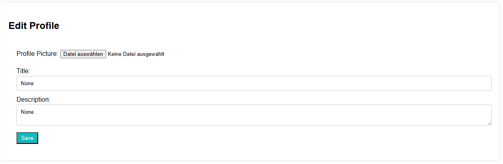

### `submit_project()`

**Route:** `/submit/`

**Methods:** `POST`

**Purpose:** Adds project to database and forwards to Portfolio-View with new project on display

**Sample output:**
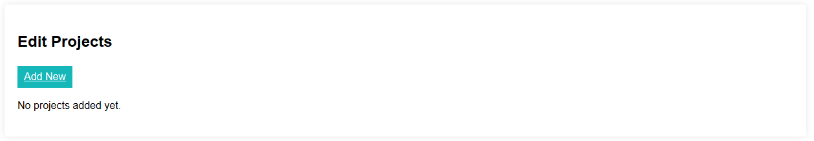

### `get_delete_project(project_id)`

**Route:** `/delete_project/<int:project_id>`

**Methods:** `POST`

**Purpose:** Deletes project from database and forwards to Portfolio-View without deleted project on display