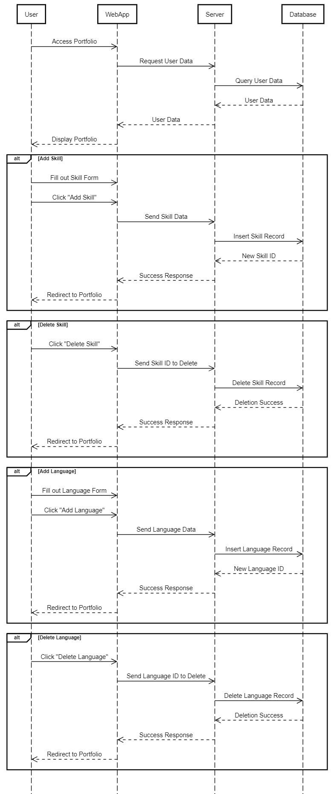

[Victoria-Kim Bui]
{: .label }

# [App behavior]
{: .no_toc }

  

    Table of contents
  

  {: .text-delta }
- TOC
{:toc}

## App Behavior

Understanding the behavior of our web application is essential for creating a seamless user experience. In this section, we delve into the app's flow, showcasing its functionality through visual aids such as an app flow diagram and sequence diagrams.

### App Flow Diagram

To provide a comprehensive overview of our application's behavior, we've created an app flow diagram. This diagram visually illustrates the various screens and interactions users will encounter while navigating the app. It maps out the user journey, from login and registration to accessing the portfolio and projects.

### Sequence Diagrams

#### Login, Registration, and Account Management

A sequence diagram offers an in-depth view of the interactions between different components during specific processes. The sequence diagram for login, registration, and account management showcases the steps involved in user authentication, registration, and managing account details.

#### Portfolio Management

The following sequence diagrams highlight the process of managing the portfolio, including projects, skills, and languages. The diagrams outline the interactions between the user, the application, and the database, demonstrating the flow of actions when users add or modify their portfolio elements.

##### Portfolio, Project, and UserProfile View

In the Web Application, users can interact with their portfolio, projects, and user profile. The following sequence diagram outlines the steps involved in managing these aspects:

1. **Accessing Portfolio:** Users navigate to the `/portfolio/` route, where the Web Application presents the portfolio page.

2. **Portfolio Editing:** Users can access the `/portfolio_edit/` route to view and edit their portfolio information, including projects and user profile.

3. **Adding Project:** Users can request to add a new project. The Web Application sends the request to the server, which then communicates with the ProjectDAO to add the project to the database.

4. **Deleting Project:** Users can delete projects they no longer wish to display. The Web Application sends the request to the server, leading to interactions with the ProjectDAO for deletion.

5. **Managing UserProfile:** Users can update their user profile details, such as profile picture, title, and description. The Web Application interacts with the server and UserProfileDAO to manage these changes.

6. **Server Response:** The server processes the requests and interactions with the DAOs. Upon success, the Web Application redirects users back to the `/portfolio_edit/` route.

##### Skill, Language, and Education View

In the Web Application, users can manage their skills, languages, and education entries. The following sequence diagram outlines the interactions involved:

1. **Accessing Portfolio:** Users navigate to the `/portfolio/` route, where they can manage their skills, languages, and education entries.

2. **Portfolio Editing:** The `/portfolio_edit/` route provides users access to edit their skills, languages, and education information.

3. **Adding Skill, Language, Education:** Users can add new skills, languages, and education entries. The Web Application communicates with the respective DAOs to add the data to the database.

4. **Deleting Skill, Language, Education:** Users can delete existing skills, languages, and education entries. The Web Application communicates with the corresponding DAOs to manage these actions.

5. **Server Response:** The server processes the interactions with the DAOs, ensuring data integrity and successful execution of user actions. Upon success, the Web Application redirects users back to the `/portfolio_edit/` route.

The Web Application's behavior in managing portfolios, projects, skills, languages, and education is streamlined and user-friendly. It enables users to efficiently add and delete various components of their profile while maintaining the integrity of their data.