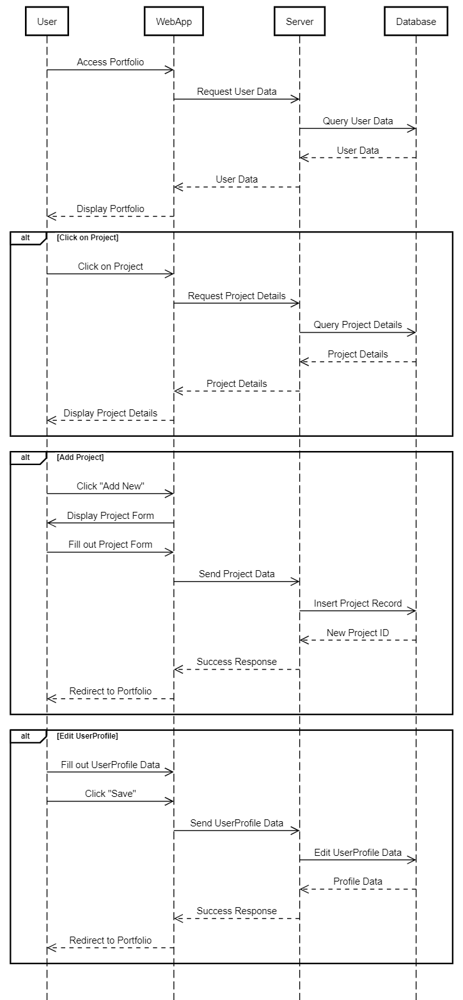

[Victoria-Kim Bui]
{: .label }

# [App behavior]
{: .no_toc }

  

    Table of contents
  

  {: .text-delta }
- TOC
{:toc}

## App Behavior

Understanding the behavior of our web application is essential for creating a seamless user experience. In this section, we delve into the app's flow, showcasing its functionality through visual aids such as an app flow diagram and sequence diagrams.

### App Flow Diagram

To provide a comprehensive overview of our application's behavior, we've created an app flow diagram. This diagram visually illustrates the various screens and interactions users will encounter while navigating the app. It maps out the user journey, from login and registration to accessing the portfolio and projects.

### Sequence Diagrams

#### Login, Registration, and Account Management

A sequence diagram offers an in-depth view of the interactions between different components during specific processes. The sequence diagram for login, registration, and account management showcases the steps involved in user authentication, registration, and managing account details.

#### Portfolio Management

The following sequence diagram highlights the process of managing the portfolio, including projects, skills, and languages. This diagram outlines the interactions between the user, the application, and the database, demonstrating the flow of actions when users add or modify their portfolio elements.

Understanding these sequence diagrams provides insight into the backend operations that drive the user experience.

By exploring the app behavior through these visual representations, we aim to ensure that users can navigate the application effortlessly and make the most of its features.
